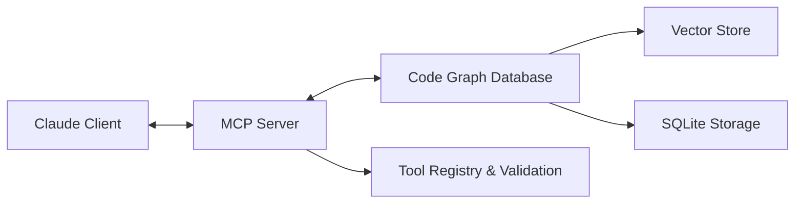

# MCP Integration Architecture

## 🎯 Overview

The Model Context Protocol (MCP) integration forms the communication bridge between the Code Graph RAG system and Claude-based AI assistants. It implements the MCP standard for seamless tool discovery, execution, and result formatting optimized for LLM consumption.

## 🏗️ Architecture Position



### Integration Flow
1. **Claude Desktop** connects via JSON-RPC 2.0 protocol
2. **MCP Server** receives tool calls and validates parameters
3. **Tool handlers** process requests using specialized agents
4. **Results** are formatted for optimal LLM consumption
5. **Responses** include structured data and natural language summaries

## 🔧 Core Implementation

### MCP Server Architecture
```typescript
import { Server } from "@modelcontextprotocol/sdk/server/index.js";
import { StdioServerTransport } from "@modelcontextprotocol/sdk/server/stdio.js";

export class CodeGraphMCPServer {
  private server: Server;
  private transport: StdioServerTransport;

  constructor(private config: MCPServerConfig) {
    this.server = new Server(
      {
        name: "code-graph-rag-mcp",
        version: "2.3.3",
      },
      {
        capabilities: {
          tools: {},
          prompts: {},      // Future: template queries
          resources: {},    // Future: file content access
        },
      }
    );
    
    this.setupToolHandlers();
    this.setupErrorHandling();
    this.setupPerformanceMonitoring();
  }

  private setupToolHandlers(): void {
    // Register all 13 MCP tools
    this.registerCoreTools();
    this.registerSemanticTools();
    this.registerAnalysisTools();
    this.registerDirectAccessTools();
  }
}
```

### Tool Registration System
```typescript
interface CodeGraphToolRegistry {
  // Core analysis tools
  index: IndexTool;
  list_file_entities: ListFileEntitiesTool;
  list_entity_relationships: ListEntityRelationshipsTool;
  query: QueryTool;
  get_metrics: GetMetricsTool;

  // Semantic analysis tools
  semantic_search: SemanticSearchTool;
  find_similar_code: FindSimilarCodeTool;
  analyze_code_impact: AnalyzeCodeImpactTool;
  detect_code_clones: DetectCodeClonesTool;
  suggest_refactoring: SuggestRefactoringTool;

  // Advanced analytics tools
  cross_language_search: CrossLanguageSearchTool;
  analyze_hotspots: AnalyzeHotspotsTool;
  find_related_concepts: FindRelatedConceptsTool;
}

// Schema definitions with Zod validation
const ListFileEntitiesSchema = z.object({
  filePath: z.string()
    .describe("Relative path of the file from repository root"),
  entityTypes: z.array(z.enum(['function', 'class', 'interface', 'variable', 'import', 'export']))
    .optional()
    .describe("Filter by specific entity types"),
  includePrivate: z.boolean()
    .default(true)
    .describe("Include private/internal entities in results")
});
```

### Tool Handler Patterns
```typescript
export class OptimizedToolHandlers {
  constructor(
    private agents: AgentCoordinator,
    private cache: QueryCache,
    private logger: StructuredLogger
  ) {}

  async handleSemanticSearch(args: SemanticSearchArgs): Promise<ToolResponse> {
    const startTime = Date.now();
    const requestId = generateRequestId();
    
    try {
      // Validate input parameters
      const { query, limit = 10, threshold = 0.7 } = SemanticSearchSchema.parse(args);
      
      // Check cache first
      const cacheKey = this.generateCacheKey('semantic_search', args);
      const cached = await this.cache.get(cacheKey);
      if (cached) {
        return this.formatSuccessResponse(cached, 'cached');
      }

      // Delegate to SemanticAgent
      const task: AgentTask = {
        id: `semantic-search-${requestId}`,
        type: 'semantic',
        priority: 5,
        payload: {
          operation: 'semantic_search',
          query,
          limit,
          threshold
        },
        createdAt: Date.now()
      };

      const semanticAgent = await this.agents.getSemanticAgent();
      const result = await semanticAgent.process(task);

      // Cache successful results
      await this.cache.set(cacheKey, result, { ttl: 300000 }); // 5 minutes

      // Log performance metrics
      this.logger.info('TOOL_EXECUTION', 'Semantic search completed', {
        requestId,
        query,
        resultCount: result.matches?.length || 0,
        duration: Date.now() - startTime,
        cacheHit: false
      });

      return this.formatSuccessResponse(result);

    } catch (error) {
      this.logger.error('TOOL_ERROR', 'Semantic search failed', {
        requestId,
        query: args.query,
        error: error.message,
        duration: Date.now() - startTime
      });

      return this.formatErrorResponse(error, 'semantic_search', args);
    }
  }

  private formatSuccessResponse(result: any, source: 'cached' | 'computed' = 'computed'): ToolResponse {
    return {
      content: [{
        type: "text",
        text: JSON.stringify({
          success: true,
          source,
          ...result
        }, null, 2)
      }]
    };
  }

  private formatErrorResponse(error: unknown, toolName: string, args: any): ToolResponse {
    const errorMessage = error instanceof Error ? error.message : String(error);
    
    return {
      content: [{
        type: "text",
        text: JSON.stringify({
          success: false,
          error: errorMessage,
          tool: toolName,
          suggestion: this.getErrorSuggestion(error, toolName)
        }, null, 2)
      }],
      isError: true
    };
  }
}
```

## 🚀 Performance Optimizations

### Response Formatting for LLMs
```typescript
export class LLMOptimizedFormatter {
  formatEntityListResponse(entities: Entity[]): string {
    if (entities.length === 0) {
      return "No entities found matching the specified criteria.";
    }

    // Group entities by type for better LLM understanding
    const grouped = this.groupEntitiesByType(entities);
    const sections = Object.entries(grouped).map(([type, items]) => {
      const formattedItems = items.map(entity => 
        `  - ${entity.name} (${entity.filePath}:${entity.location.start.line})`
      ).join('\n');
      
      return `${type}s (${items.length}):\n${formattedItems}`;
    });

    return `Found ${entities.length} entities:\n\n${sections.join('\n\n')}`;
  }

  formatRelationshipResponse(relationships: Relationship[]): string {
    if (relationships.length === 0) {
      return "No relationships found for the specified entity.";
    }

    const byType = this.groupRelationshipsByType(relationships);
    const sections = Object.entries(byType).map(([type, rels]) => {
      const formatted = rels.map(rel => 
        `  - ${rel.fromId} → ${rel.toId} (${rel.metadata?.context || 'direct'})`
      ).join('\n');
      
      return `${type} relationships (${rels.length}):\n${formatted}`;
    });

    return sections.join('\n\n');
  }

  formatSemanticSearchResponse(results: SemanticSearchResult[]): string {
    if (results.length === 0) {
      return "No semantic matches found for the query.";
    }

    const formattedResults = results.map((result, index) => {
      const relevancePercent = Math.round(result.similarity * 100);
      return `${index + 1}. ${result.entity.name} (${relevancePercent}% relevant)
   File: ${result.entity.filePath}:${result.entity.location.start.line}
   Type: ${result.entity.type}
   Context: ${result.context || 'No additional context'}`;
    }).join('\n\n');

    return `Found ${results.length} semantic matches:\n\n${formattedResults}`;
  }
}
```

### Caching and Performance
```typescript
export class PerformanceOptimizer {
  private queryCache: LRUCache<string, any>;
  private responseCache: LRUCache<string, ToolResponse>;
  private performanceMonitor: PerformanceMonitor;

  constructor(config: PerformanceConfig) {
    this.queryCache = new LRUCache({
      max: config.queryCacheSize || 1000,
      maxAge: config.queryCacheTTL || 300000, // 5 minutes
      updateAgeOnGet: true
    });

    this.responseCache = new LRUCache({
      max: config.responseCacheSize || 500,
      maxAge: config.responseCacheTTL || 60000, // 1 minute
      updateAgeOnGet: true
    });

    this.performanceMonitor = new PerformanceMonitor();
  }

  async optimizeToolExecution<T>(
    toolName: string,
    handler: () => Promise<T>,
    cacheKey?: string
  ): Promise<T> {
    const startTime = Date.now();
    const memoryBefore = process.memoryUsage().heapUsed;

    try {
      // Check cache if key provided
      if (cacheKey) {
        const cached = this.queryCache.get(cacheKey);
        if (cached) {
          return cached;
        }
      }

      // Execute with performance monitoring
      const result = await this.performanceMonitor.measure(
        `tool_${toolName}`,
        handler
      );

      // Cache successful results
      if (cacheKey && result) {
        this.queryCache.set(cacheKey, result);
      }

      // Record performance metrics
      const duration = Date.now() - startTime;
      const memoryUsed = process.memoryUsage().heapUsed - memoryBefore;
      
      this.performanceMonitor.recordToolMetrics(toolName, {
        duration,
        memoryUsed,
        success: true
      });

      return result;

    } catch (error) {
      const duration = Date.now() - startTime;
      this.performanceMonitor.recordToolMetrics(toolName, {
        duration,
        success: false,
        error: error.message
      });
      throw error;
    }
  }

  // Memory-efficient streaming for large results
  async *streamLargeResults<T>(
    results: T[],
    chunkSize: number = 50
  ): AsyncGenerator<T[]> {
    for (let i = 0; i < results.length; i += chunkSize) {
      const chunk = results.slice(i, i + chunkSize);
      yield chunk;
      
      // Yield control to prevent blocking
      await new Promise(resolve => setImmediate(resolve));
    }
  }
}
```

## 🔄 Agent Integration

### Multi-Agent Coordination
```typescript
export class AgentCoordinator {
  private agents: Map<string, Agent> = new Map();
  private taskQueue: PriorityQueue<AgentTask> = new PriorityQueue();
  private activeTaskLimit: number = 3;

  constructor() {
    this.initializeAgents();
    this.startTaskProcessor();
  }

  private initializeAgents(): void {
    this.agents.set('conductor', new ConductorAgent());
    this.agents.set('parser', new ParserAgent());
    this.agents.set('indexer', new IndexerAgent());
    this.agents.set('query', new QueryAgent());
    this.agents.set('semantic', new SemanticAgent());
    this.agents.set('dev', new DevAgent());
    this.agents.set('dora', new DoraAgent());
  }

  async processComplexTool(
    toolName: string,
    args: any,
    complexity: number
  ): Promise<ToolResponse> {
    if (complexity > 5) {
      // Use Conductor for complex operations
      return await this.delegateToAgent('conductor', {
        operation: toolName,
        args,
        complexity,
        requiresApproval: true
      });
    } else {
      // Direct agent processing for simple operations
      const agentType = this.selectAppropriateAgent(toolName);
      return await this.delegateToAgent(agentType, {
        operation: toolName,
        args
      });
    }
  }

  private selectAppropriateAgent(toolName: string): string {
    const agentMapping = {
      'semantic_search': 'semantic',
      'find_similar_code': 'semantic',
      'list_file_entities': 'parser',
      'analyze_code_impact': 'query',
      'detect_code_clones': 'semantic',
      'suggest_refactoring': 'semantic',
      'cross_language_search': 'semantic',
      'analyze_hotspots': 'query',
      'find_related_concepts': 'semantic'
    };

    return agentMapping[toolName] || 'query';
  }
}
```

### Error Handling and Resilience
```typescript
export class ResilientMCPHandler {
  async handleToolCall(
    toolName: string,
    args: any,
    options: ToolCallOptions = {}
  ): Promise<ToolResponse> {
    const { retries = 2, timeout = 30000, fallback = true } = options;
    
    for (let attempt = 0; attempt <= retries; attempt++) {
      try {
        // Execute with timeout
        const result = await Promise.race([
          this.executeToolHandler(toolName, args),
          this.createTimeoutPromise(timeout, toolName)
        ]);

        return result;

      } catch (error) {
        this.logger.warn('TOOL_RETRY', `Tool ${toolName} failed, attempt ${attempt + 1}`, {
          error: error.message,
          args: this.sanitizeArgs(args)
        });

        if (attempt === retries) {
          // Final attempt failed
          if (fallback) {
            return await this.attemptFallback(toolName, args, error);
          } else {
            throw error;
          }
        }

        // Wait before retry with exponential backoff
        await this.sleep(Math.pow(2, attempt) * 1000);
      }
    }
  }

  private async attemptFallback(
    toolName: string,
    args: any,
    originalError: Error
  ): Promise<ToolResponse> {
    try {
      // Attempt simplified version of the operation
      const simplifiedResult = await this.executeSimplifiedTool(toolName, args);
      
      return {
        content: [{
          type: "text",
          text: JSON.stringify({
            success: true,
            result: simplifiedResult,
            note: "Returned simplified result due to processing constraints",
            originalError: originalError.message
          }, null, 2)
        }]
      };

    } catch (fallbackError) {
      // Both primary and fallback failed
      return {
        content: [{
          type: "text",
          text: JSON.stringify({
            success: false,
            error: originalError.message,
            fallbackError: fallbackError.message,
            suggestion: this.generateRecoveryStrategy(toolName, originalError)
          }, null, 2)
        }],
        isError: true
      };
    }
  }
}
```

## 📊 Monitoring and Analytics

### Tool Usage Analytics
```typescript
export class MCPAnalytics {
  private toolUsageStats: Map<string, ToolUsageMetrics> = new Map();
  private performanceHistory: PerformanceHistory = new PerformanceHistory();

  recordToolUsage(
    toolName: string,
    duration: number,
    success: boolean,
    resultSize: number
  ): void {
    const stats = this.toolUsageStats.get(toolName) || this.createEmptyStats();
    
    stats.totalCalls++;
    stats.totalDuration += duration;
    stats.successCount += success ? 1 : 0;
    stats.avgResultSize = (stats.avgResultSize + resultSize) / 2;
    stats.lastUsed = new Date();
    
    this.toolUsageStats.set(toolName, stats);
    this.performanceHistory.addDataPoint(toolName, duration, success);
  }

  generateUsageReport(): ToolUsageReport {
    const toolStats = Array.from(this.toolUsageStats.entries()).map(([name, stats]) => ({
      toolName: name,
      totalCalls: stats.totalCalls,
      successRate: stats.successCount / stats.totalCalls,
      avgDurationMs: stats.totalDuration / stats.totalCalls,
      avgResultSize: stats.avgResultSize,
      trendsLast7Days: this.performanceHistory.getTrends(name, 7)
    }));

    return {
      generatedAt: new Date(),
      totalTools: toolStats.length,
      totalCalls: toolStats.reduce((sum, s) => sum + s.totalCalls, 0),
      overallSuccessRate: this.calculateOverallSuccessRate(toolStats),
      performanceInsights: this.generatePerformanceInsights(toolStats),
      recommendations: this.generateOptimizationRecommendations(toolStats)
    };
  }

  async exportMetrics(): Promise<ExportedMetrics> {
    return {
      timestamp: new Date(),
      toolUsage: Object.fromEntries(this.toolUsageStats),
      performanceHistory: await this.performanceHistory.export(),
      systemHealth: await this.getSystemHealthSnapshot()
    };
  }
}
```

### Health Monitoring
```typescript
export class MCPHealthMonitor {
  async checkSystemHealth(): Promise<HealthReport> {
    const startTime = Date.now();
    
    try {
      const [
        databaseHealth,
        agentHealth,
        memoryUsage,
        responseTimeHealth
      ] = await Promise.all([
        this.checkDatabaseHealth(),
        this.checkAgentHealth(),
        this.checkMemoryUsage(),
        this.checkResponseTimeHealth()
      ]);

      const overallHealth = this.calculateOverallHealth([
        databaseHealth,
        agentHealth,
        memoryUsage,
        responseTimeHealth
      ]);

      return {
        status: overallHealth.status,
        timestamp: new Date(),
        responseTime: Date.now() - startTime,
        components: {
          database: databaseHealth,
          agents: agentHealth,
          memory: memoryUsage,
          responseTime: responseTimeHealth
        },
        recommendations: overallHealth.recommendations
      };

    } catch (error) {
      return {
        status: 'unhealthy',
        timestamp: new Date(),
        responseTime: Date.now() - startTime,
        error: error.message,
        recommendations: ['Investigate system connectivity', 'Check resource availability']
      };
    }
  }

  private async checkAgentHealth(): Promise<ComponentHealth> {
    const agentStatuses = await Promise.all(
      Array.from(this.agents.values()).map(agent => agent.getHealthStatus())
    );

    const healthyAgents = agentStatuses.filter(s => s.status === 'healthy').length;
    const totalAgents = agentStatuses.length;

    return {
      status: healthyAgents === totalAgents ? 'healthy' : 
              healthyAgents > totalAgents * 0.7 ? 'degraded' : 'unhealthy',
      details: {
        healthyAgents,
        totalAgents,
        agentDetails: agentStatuses
      }
    };
  }
}
```

## 🔧 Configuration Management

### Environment-Based Configuration
```typescript
interface MCPServerConfig {
  // Server settings
  name: string;
  version: string;
  maxConcurrentTools: number;
  requestTimeout: number;
  
  // Performance settings
  caching: {
    enabled: boolean;
    queryTTL: number;
    responseTTL: number;
    maxCacheSize: number;
  };
  
  // Agent coordination
  agents: {
    defaultTimeout: number;
    maxConcurrentAgents: number;
    retryAttempts: number;
  };
  
  // Monitoring
  monitoring: {
    enabled: boolean;
    metricsInterval: number;
    healthCheckInterval: number;
  };
}

const mcpConfig: MCPServerConfig = {
  name: process.env.MCP_SERVER_NAME || 'code-graph-rag-mcp',
  version: process.env.MCP_SERVER_VERSION || '2.3.3',
  maxConcurrentTools: parseInt(process.env.MCP_MAX_CONCURRENT_TOOLS || '5'),
  requestTimeout: parseInt(process.env.MCP_REQUEST_TIMEOUT || '30000'),
  
  caching: {
    enabled: process.env.MCP_CACHING_ENABLED !== 'false',
    queryTTL: parseInt(process.env.MCP_QUERY_TTL || '300000'),
    responseTTL: parseInt(process.env.MCP_RESPONSE_TTL || '60000'),
    maxCacheSize: parseInt(process.env.MCP_MAX_CACHE_SIZE || '1000')
  },
  
  agents: {
    defaultTimeout: parseInt(process.env.MCP_AGENT_TIMEOUT || '30000'),
    maxConcurrentAgents: parseInt(process.env.MCP_MAX_CONCURRENT_AGENTS || '3'),
    retryAttempts: parseInt(process.env.MCP_RETRY_ATTEMPTS || '2')
  },
  
  monitoring: {
    enabled: process.env.MCP_MONITORING_ENABLED !== 'false',
    metricsInterval: parseInt(process.env.MCP_METRICS_INTERVAL || '60000'),
    healthCheckInterval: parseInt(process.env.MCP_HEALTH_CHECK_INTERVAL || '30000')
  }
};
```

## 🚀 Future Enhancements

### Advanced Protocol Features
```typescript
// Prompt templates for common code analysis patterns
interface PromptTemplate {
  name: string;
  description: string;
  template: string;
  parameters: ParameterDefinition[];
}

const codeAnalysisPrompts: PromptTemplate[] = [
  {
    name: "explain_function_with_context",
    description: "Generate comprehensive function explanation with context",
    template: `
      Analyze the function "{{functionName}}" in {{filePath}}:
      
      Function Details:
      {{functionDetails}}
      
      Dependencies:
      {{dependencies}}
      
      Usage Context:
      {{usageContext}}
      
      Explain the function's purpose, implementation approach, and role in the codebase.
    `,
    parameters: [
      { name: "functionName", type: "string", required: true },
      { name: "filePath", type: "string", required: true }
    ]
  }
];

// Resource access for file content
export class ResourceProvider {
  async getFileContent(uri: string): Promise<ResourceContent> {
    const content = await this.fileSystem.readFile(uri);
    
    return {
      uri,
      mimeType: this.detectMimeType(uri),
      content,
      metadata: {
        size: content.length,
        lastModified: await this.fileSystem.getLastModified(uri),
        language: this.detectLanguage(uri)
      }
    };
  }
}
```

---

*This MCP integration architecture enables seamless communication between Claude Desktop and the Code Graph RAG system, providing 13 specialized tools for comprehensive code analysis with optimal performance and reliability.*

**Document Version**: 1.0 | **Last Updated**: 2025-01-22 | **Next Review**: 2025-02-15