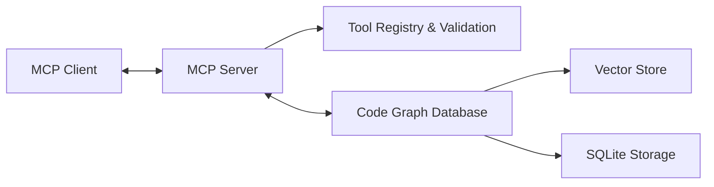

# MCP Integration Architecture (v2.4.0)

## 🎯 Overview

The Model Context Protocol (MCP) integration is the communication bridge between Code Graph RAG and MCP clients (Claude Desktop, Gemini CLI, Codex CLI). Version 2.4.0 consolidates multi‑agent orchestration, graph health/maintenance tools, and resiliency improvements while keeping responses optimized for LLM consumption.

## 🏗️ Architecture Position



### Integration Flow
1. Client connects via JSON-RPC 2.0 over stdio
2. MCP server advertises tools and schemas (Zod → JSON Schema)
3. Handlers delegate work through the Conductor to specialized agents
4. Results are structured (JSON) and LLM-friendly text summaries
5. Caching and timeouts guard performance; circuit breakers add resilience

## 🔧 Core Implementation

### MCP Server Skeleton
```typescript
import { Server } from "@modelcontextprotocol/sdk/server/index.js";
import { StdioServerTransport } from "@modelcontextprotocol/sdk/server/stdio.js";

export class CodeGraphMCPServer {
  private server: Server;
  private transport: StdioServerTransport;

  constructor(private config: MCPServerConfig) {
    this.server = new Server(
      {
        name: "code-graph-rag-mcp",
        version: "2.4.0",
      },
      {
        capabilities: {
          tools: {},
          prompts: {},      // future: template queries
          resources: {},    // future: file content access
        },
      }
    );

    this.setupToolHandlers();
    this.setupErrorHandling();
    this.setupPerformanceMonitoring();
  }

  private setupToolHandlers(): void {
    // Tool portfolio (v2.4.0)
    this.registerCoreTools();          // index, list_file_entities, list_entity_relationships, query, get_metrics
    this.registerSemanticTools();      // semantic_search, find_similar_code, detect_code_clones, suggest_refactoring,
                                       // cross_language_search, analyze_hotspots, find_related_concepts
    this.registerDirectAccessTools();  // get_graph, get_graph_stats
    this.registerMaintenanceTools();   // get_graph_health, reset_graph, clean_index
  }
}
```

### Tool Registration Snapshot
```typescript
interface CodeGraphToolRegistry {
  // Core
  index: IndexTool;
  list_file_entities: ListFileEntitiesTool;
  list_entity_relationships: ListEntityRelationshipsTool;
  query: QueryTool;
  get_metrics: GetMetricsTool;

  // Semantic
  semantic_search: SemanticSearchTool;
  find_similar_code: FindSimilarCodeTool;
  detect_code_clones: DetectCodeClonesTool;
  suggest_refactoring: SuggestRefactoringTool;
  cross_language_search: CrossLanguageSearchTool;
  analyze_hotspots: AnalyzeHotspotsTool;
  find_related_concepts: FindRelatedConceptsTool;

  // Direct graph access
  get_graph: GetGraphTool;
  get_graph_stats: GetGraphStatsTool;

  // Health & maintenance
  get_graph_health: GetGraphHealthTool;
  reset_graph: ResetGraphTool;
  clean_index: CleanIndexTool;
}

// Example of schema with Zod (ListFileEntities)
const ListFileEntitiesSchema = z.object({
  filePath: z.string().describe("Path to the file to list entities from"),
  entityTypes: z.array(z.string()).optional(),
});
```

### Caching, Timeouts & Resilience
- Per-operation timeouts are enforced to surface actionable errors to clients and avoid hangs.
- KnowledgeBus provides in-memory pub/sub with TTL to share intermediate results across agents.
- SemanticAgent employs a three-state circuit breaker (CLOSED → OPEN → HALF_OPEN). When OPEN, it returns a fallback response with a degraded flag; HALF_OPEN probes recovery before moving back to CLOSED.

## 🔄 Agent Integration

### Conductor-Orchestrated Multi-Agent Design
- Conductor enforces mandatory delegation and proposes 5 methods with a complexity score (approval required when score > 5).
- Specialized agents: Indexer (graph persistence), Query (traversal/analysis), Semantic (embeddings + hybrid search), Dev (implementation/indexing orchestration), Dora (research/documentation). Parser can be toggled based on platform constraints.

Agent selection for tools (current build):
- list_file_entities → DevAgent heuristics (ParserAgent may be disabled on some platforms)
- analyze_hotspots → QueryAgent
- semantic_* → SemanticAgent

## 🧩 Configuration, Storage & Logging

- YAML configuration loader with ENV fallbacks centralizes server, agent and parser settings (`src/config/yaml-config.ts`).
- GraphStorage is a singleton via factory to ensure a single DB connection across all agents and tools (`src/storage/graph-storage-factory.ts`).
- Rotated structured logs are written to `logs_llm/` with categories (SYSTEM, MCP_REQUEST, MCP_ERROR, etc.).

## 🩺 Health & Smoke

Tools: `get_graph_stats`, `get_graph_health`, `reset_graph`, `clean_index`

Smoke scripts:
- `scripts/smoke-graph-health.js` – validates graph counts and health
- `scripts/smoke-semantic.js` – validates semantic routes (search + similarity)

## 🔗 Code References
- Server entrypoint and tools: `src/index.ts`
- Conductor Orchestrator: `src/agents/conductor-orchestrator.ts`
- QueryAgent and processor: `src/agents/query-agent.ts`, `src/query/graph-query-processor.ts`
- SemanticAgent (circuit breaker): `src/agents/semantic-agent.ts`
- Graph storage (singleton): `src/storage/graph-storage-factory.ts`, `src/storage/graph-storage.ts`
- YAML config loader: `src/config/yaml-config.ts`
- Logger config: `src/config/logging-config.ts`

---
Document version: 2.4.0 • Last updated: 2025-09-23

