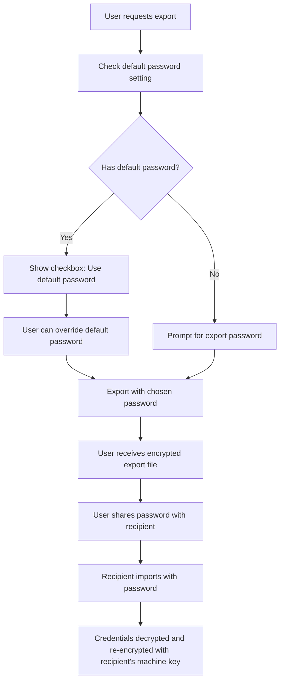

# Security Implementation Guide

This document outlines security principles, implementation details, and best practices for the xldb_proxy system.

## Security Overview

The xldb_proxy implements multiple layers of security to protect sensitive database credentials, ensure secure data transmission, and prevent unauthorized access.

### Security Principles

1. **Defense in Depth**: Multiple security layers for comprehensive protection
2. **Least Privilege**: Minimal access rights for all components
3. **Data Protection**: Encryption for sensitive data at rest and in transit
4. **Secure by Default**: Security-first configuration and deployment
5. **Audit and Compliance**: Comprehensive logging and monitoring

## Credential Security

### Encryption at Rest

All sensitive credentials are encrypted before storage using symmetric encryption.

#### Implementation

```python
from tools.crypto import encrypt, decrypt
import secrets
import base64

class CredentialManager:
    def __init__(self):
        self.encryption_key = self._load_or_generate_key()
    
    def _load_or_generate_key(self):
        """Load existing key or generate new one"""
        key_file = compat.get_secure_config_path("encryption.key")
        
        if os.path.exists(key_file):
            with open(key_file, 'rb') as f:
                return f.read()
        else:
            # Generate new 256-bit key
            key = secrets.token_bytes(32)
            
            # Save with secure permissions
            os.makedirs(os.path.dirname(key_file), mode=0o700, exist_ok=True)
            with open(key_file, 'wb') as f:
                f.write(key)
            os.chmod(key_file, 0o600)
            
            return key
    
    def encrypt_record(self, record: dict):
        """Encrypt sensitive fields in connection record"""
        if "password" in record:
            record['password'] = encrypt(record['password'], self.encryption_key)
        if "user" in record:
            record['user'] = encrypt(record['user'], self.encryption_key)
        return record
    
    def decrypt_record(self, record: dict):
        """Decrypt sensitive fields when needed"""
        if record.get('password'):
            record['password'] = decrypt(record['password'], self.encryption_key)
        if record.get('user'):
            record['user'] = decrypt(record['user'], self.encryption_key)
        return record
```

#### Key Management Strategy

```python
def generate_machine_specific_key():
    """Generate encryption key unique to each machine"""
    import platform
    import hashlib
    
    # Combine machine-specific identifiers
    machine_id = platform.node()  # Hostname
    mac_address = get_mac_address()
    system_info = platform.system() + platform.release()
    
    # Create deterministic but unique key
    key_material = f"{machine_id}{mac_address}{system_info}".encode()
    salt = b"xldb_proxy_salt_v1"  # Application-specific salt
    
    # Derive key using PBKDF2
    key = hashlib.pbkdf2_hmac('sha256', key_material, salt, 100000)
    return key
```

**Benefits:**
- Each machine has unique encryption key
- Compromise of one machine doesn't affect others
- No shared encryption keys across environments

### Export/Import Security

The system supports secure credential exchange between environments.

#### Export with Password Protection

```python
def export_connections(export_password: str = None) -> dict:
    """Export connections with optional password protection"""
    connections = get_all_connections()
    
    if export_password:
        # Re-encrypt with export password for portability
        for conn in connections:
            if conn.get('password'):
                # Decrypt with machine key, re-encrypt with export password
                decrypted = decrypt(conn['password'], machine_key)
                conn['password'] = encrypt_with_password(decrypted, export_password)
            
            if conn.get('user'):
                decrypted = decrypt(conn['user'], machine_key)
                conn['user'] = encrypt_with_password(decrypted, export_password)
    
    return {
        'connections': connections,
        'export_metadata': {
            'timestamp': datetime.now().isoformat(),
            'encryption': 'password' if export_password else 'machine_key',
            'format_version': '1.0'
        }
    }
```

#### Import with Conflict Resolution

```python
def import_connections(data: dict, import_password: str = None, 
                      conflict_strategy: str = 'prompt') -> dict:
    """Import connections with security validation"""
    results = {}
    
    # Validate import format and metadata
    if not validate_import_format(data):
        raise SecurityError("Invalid import format or corrupted data")
    
    for conn_data in data['connections']:
        connection_key = conn_data['connection_key']
        
        try:
            # Decrypt credentials if password protected
            if import_password and data['export_metadata']['encryption'] == 'password':
                decrypt_import_credentials(conn_data, import_password)
            
            # Re-encrypt with current machine key
            encrypt_record(conn_data)
            
            # Handle conflicts based on strategy
            result = handle_connection_conflict(connection_key, conn_data, conflict_strategy)
            results[connection_key] = result
            
        except DecryptionError:
            results[connection_key] = 'wrong_password'
        except Exception as e:
            logger.error(f"Import error for {connection_key}: {e}")
            results[connection_key] = 'error'
    
    return results
```

### Security Flow Diagram



## Database Connection Security

### SSL/TLS Configuration

Support for encrypted database connections across all engines.

#### PostgreSQL SSL Example

```python
class EngineConnectionPostgres(Connection):
    def open(self):
        ssl_config = self.params.ssl
        
        connection_params = {
            'host': self.params.sql.dbms_host,
            'port': self.params.sql.dbms_port,
            'database': self.params.sql.database,
            'user': self.params.sql.user,
            'password': self.params.sql.password
        }
        
        if ssl_config and ssl_config.enabled:
            # Configure SSL parameters
            connection_params.update({
                'sslmode': ssl_config.mode or 'require',
                'sslcert': ssl_config.client_cert,
                'sslkey': ssl_config.client_key,
                'sslrootcert': ssl_config.ca_cert,
                'sslcrl': ssl_config.crl_file
            })
        
        self.connection = psycopg2.connect(**connection_params)
```

#### SSL Configuration Models

```python
class SSLConfig(BaseModel):
    enabled: bool = False
    mode: Optional[str] = "require"  # disable, allow, prefer, require, verify-ca, verify-full
    ca_cert: Optional[str] = None    # Path to CA certificate
    client_cert: Optional[str] = None  # Path to client certificate
    client_key: Optional[str] = None   # Path to client private key
    crl_file: Optional[str] = None     # Certificate revocation list
    verify_hostname: bool = True

class ConnectionParams(BaseModel):
    sql: SqlConnectionParams
    ssl: Optional[SSLConfig] = None
```

### Connection Validation

```python
def validate_secure_connection(connection_params: ConnectionParams) -> bool:
    """Validate connection security requirements"""
    
    # Check for production environment requirements
    if is_production_environment():
        if not connection_params.ssl or not connection_params.ssl.enabled:
            raise SecurityError("SSL required for production connections")
        
        if connection_params.ssl.mode in ['disable', 'allow']:
            raise SecurityError("Insecure SSL mode not allowed in production")
    
    # Validate certificate files exist and are readable
    if connection_params.ssl and connection_params.ssl.enabled:
        validate_ssl_certificates(connection_params.ssl)
    
    return True

def validate_ssl_certificates(ssl_config: SSLConfig):
    """Validate SSL certificate files"""
    cert_files = [
        ('ca_cert', ssl_config.ca_cert),
        ('client_cert', ssl_config.client_cert),
        ('client_key', ssl_config.client_key)
    ]
    
    for cert_type, cert_path in cert_files:
        if cert_path:
            if not os.path.exists(cert_path):
                raise SecurityError(f"SSL {cert_type} file not found: {cert_path}")
            
            if not os.access(cert_path, os.R_OK):
                raise SecurityError(f"SSL {cert_type} file not readable: {cert_path}")
            
            # Validate certificate format
            if cert_type in ['ca_cert', 'client_cert']:
                validate_certificate_format(cert_path)
```

## API Security

### Input Validation and Sanitization

```python
from pydantic import BaseModel, Field, validator
import re

class QueryParams(BaseModel):
    query: str = Field(..., max_length=10000)
    limit: Optional[int] = Field(None, ge=1, le=100000)
    
    @validator('query')
    def validate_sql(cls, v):
        """Validate SQL query for security"""
        # Remove comments and normalize whitespace
        normalized = re.sub(r'--.*$', '', v, flags=re.MULTILINE)
        normalized = re.sub(r'/\*.*?\*/', '', normalized, flags=re.DOTALL)
        normalized = ' '.join(normalized.split())
        
        # Check for dangerous keywords
        dangerous_patterns = [
            r'\bDROP\s+\w+',
            r'\bDELETE\s+FROM',
            r'\bTRUNCATE\s+\w+',
            r'\bALTER\s+\w+',
            r'\bCREATE\s+\w+',
            r'\bGRANT\s+\w+',
            r'\bREVOKE\s+\w+',
            r'\bEXEC\s*\(',
            r'\bxp_\w+',  # SQL Server extended procedures
            r'\bsp_\w+'   # SQL Server system procedures
        ]
        
        for pattern in dangerous_patterns:
            if re.search(pattern, normalized, re.IGNORECASE):
                raise ValueError(f"Potentially dangerous SQL detected")
        
        return v
```

### SQL Injection Prevention

```python
def safe_query_execution(connection, query: str, params: dict = None):
    """Execute query with SQL injection prevention"""
    
    # Use parameterized queries when possible
    if params and connection.supports_parameters():
        return connection.execute_parameterized(query, params)
    
    # For engines that don't support parameterization, use escaping
    escaped_query = escape_sql_string(query)
    
    # Add query execution logging
    query_hash = hashlib.sha256(escaped_query.encode()).hexdigest()[:8]
    logger.info(f"Executing query {query_hash}: {escaped_query[:100]}...")
    
    return connection.execute(escaped_query)

def escape_sql_string(value: str) -> str:
    """Escape SQL string to prevent injection"""
    # Escape single quotes
    escaped = value.replace("'", "''")
    
    # Remove null bytes
    escaped = escaped.replace('\x00', '')
    
    # Remove other control characters
    escaped = ''.join(char for char in escaped if ord(char) >= 32 or char in '\n\r\t')
    
    return escaped
```

### Rate Limiting

```python
from slowapi import Limiter, _rate_limit_exceeded_handler
from slowapi.util import get_remote_address
from slowapi.errors import RateLimitExceeded
import redis

# Initialize rate limiter with Redis backend
redis_client = redis.Redis(host='localhost', port=6379, db=0)
limiter = Limiter(key_func=get_remote_address, storage_uri="redis://localhost:6379")

app.state.limiter = limiter
app.add_exception_handler(RateLimitExceeded, _rate_limit_exceeded_handler)

# Apply rate limits to sensitive endpoints
@router.post("/connection/add")
@limiter.limit("10/minute")  # Limit connection creation
def create_connection(request: Request, params: NewConnectionParams):
    return handle_connection_creation(params)

@router.post("/query/run")
@limiter.limit("100/minute")  # Limit query execution
def execute_query(request: Request, query_params: QueryParams):
    return handle_query_execution(query_params)

# Implement progressive rate limiting
class ProgressiveRateLimiter:
    def __init__(self):
        self.failure_counts = {}
        self.lockout_times = {}
    
    def check_rate_limit(self, client_ip: str) -> bool:
        """Implement progressive backoff for failed attempts"""
        current_time = time.time()
        
        # Clear expired lockouts
        if client_ip in self.lockout_times:
            if current_time > self.lockout_times[client_ip]:
                del self.lockout_times[client_ip]
                self.failure_counts[client_ip] = 0
        
        # Check if currently locked out
        if client_ip in self.lockout_times:
            raise HTTPException(status_code=429, detail="Too many failed attempts")
        
        return True
    
    def record_failure(self, client_ip: str):
        """Record failed attempt and apply progressive lockout"""
        self.failure_counts[client_ip] = self.failure_counts.get(client_ip, 0) + 1
        
        # Progressive lockout: 1min, 5min, 15min, 1hour
        failure_count = self.failure_counts[client_ip]
        lockout_durations = [60, 300, 900, 3600]
        
        if failure_count >= len(lockout_durations):
            lockout_duration = lockout_durations[-1]  # Max lockout
        else:
            lockout_duration = lockout_durations[failure_count - 1]
        
        self.lockout_times[client_ip] = time.time() + lockout_duration
```

## Security Headers and CORS

```python
from fastapi.middleware.cors import CORSMiddleware
from fastapi.middleware.trustedhost import TrustedHostMiddleware

# Configure CORS with security in mind
app.add_middleware(
    CORSMiddleware,
    allow_origins=["https://app.example.com", "https://admin.example.com"],  # Specific origins only
    allow_credentials=True,
    allow_methods=["GET", "POST", "PUT", "DELETE"],
    allow_headers=["Authorization", "Content-Type"],
    expose_headers=["X-Request-ID"]
)

# Restrict allowed hosts
app.add_middleware(
    TrustedHostMiddleware, 
    allowed_hosts=["xldb-proxy.example.com", "localhost", "127.0.0.1"]
)

# Add security headers middleware
@app.middleware("http")
async def add_security_headers(request: Request, call_next):
    response = await call_next(request)
    
    # Security headers
    response.headers["X-Content-Type-Options"] = "nosniff"
    response.headers["X-Frame-Options"] = "DENY"
    response.headers["X-XSS-Protection"] = "1; mode=block"
    response.headers["Strict-Transport-Security"] = "max-age=31536000; includeSubDomains"
    response.headers["Referrer-Policy"] = "strict-origin-when-cross-origin"
    response.headers["Content-Security-Policy"] = "default-src 'self'"
    
    # Remove server identification
    response.headers.pop("Server", None)
    
    return response
```

## Audit Logging and Monitoring

### Security Event Logging

```python
import structlog
from enum import Enum

class SecurityEventType(Enum):
    LOGIN_ATTEMPT = "login_attempt"
    CONNECTION_CREATED = "connection_created"
    CONNECTION_DELETED = "connection_deleted"
    QUERY_EXECUTED = "query_executed"
    EXPORT_REQUESTED = "export_requested"
    IMPORT_ATTEMPTED = "import_attempted"
    RATE_LIMIT_EXCEEDED = "rate_limit_exceeded"
    SUSPICIOUS_ACTIVITY = "suspicious_activity"

class SecurityLogger:
    def __init__(self):
        self.logger = structlog.get_logger("security")
    
    def log_event(self, event_type: SecurityEventType, 
                  user_context: dict = None, 
                  additional_data: dict = None):
        """Log security-relevant events"""
        
        event_data = {
            'event_type': event_type.value,
            'timestamp': datetime.now().isoformat(),
            'request_id': get_request_id(),
            'client_ip': get_client_ip(),
            'user_agent': get_user_agent()
        }
        
        if user_context:
            event_data['user_context'] = user_context
        
        if additional_data:
            event_data.update(additional_data)
        
        self.logger.info("Security event", **event_data)
    
    def log_connection_access(self, connection_key: str, access_type: str):
        """Log database connection access"""
        self.log_event(
            SecurityEventType.QUERY_EXECUTED,
            additional_data={
                'connection_key': connection_key,
                'access_type': access_type,
                'sensitive_operation': True
            }
        )
    
    def log_credential_access(self, operation: str, connection_id: str):
        """Log credential-related operations"""
        self.log_event(
            SecurityEventType.CONNECTION_CREATED,
            additional_data={
                'operation': operation,
                'connection_id': connection_id,
                'credential_operation': True
            }
        )

# Initialize security logger
security_logger = SecurityLogger()

# Use in endpoints
@router.post("/connection/add")
def create_connection(params: NewConnectionParams):
    try:
        result = handle_connection_creation(params)
        security_logger.log_credential_access("create", result['connection_id'])
        return result
    except Exception as e:
        security_logger.log_event(
            SecurityEventType.SUSPICIOUS_ACTIVITY,
            additional_data={'error': str(e), 'operation': 'connection_create'}
        )
        raise
```

### Intrusion Detection

```python
class IntrusionDetector:
    def __init__(self):
        self.suspicious_patterns = [
            r'UNION\s+SELECT',  # SQL injection attempt
            r'OR\s+1=1',        # SQL injection attempt
            r'<script',         # XSS attempt
            r'javascript:',     # XSS attempt
            r'\.\./.*\.\.',     # Path traversal
            r'%2e%2e%2f',       # Encoded path traversal
        ]
        
        self.rate_trackers = {}
    
    def analyze_request(self, request: Request) -> dict:
        """Analyze request for suspicious patterns"""
        findings = []
        risk_score = 0
        
        # Check URL and parameters
        full_url = str(request.url)
        for pattern in self.suspicious_patterns:
            if re.search(pattern, full_url, re.IGNORECASE):
                findings.append(f"Suspicious pattern in URL: {pattern}")
                risk_score += 10
        
        # Check request body if present
        if hasattr(request, '_body'):
            body = request._body.decode('utf-8', errors='ignore')
            for pattern in self.suspicious_patterns:
                if re.search(pattern, body, re.IGNORECASE):
                    findings.append(f"Suspicious pattern in body: {pattern}")
                    risk_score += 15
        
        # Check request rate
        client_ip = get_client_ip(request)
        current_time = time.time()
        
        if client_ip not in self.rate_trackers:
            self.rate_trackers[client_ip] = []
        
        # Clean old requests (last 60 seconds)
        self.rate_trackers[client_ip] = [
            timestamp for timestamp in self.rate_trackers[client_ip]
            if current_time - timestamp < 60
        ]
        
        # Add current request
        self.rate_trackers[client_ip].append(current_time)
        
        # Check if rate is too high
        request_rate = len(self.rate_trackers[client_ip])
        if request_rate > 100:  # More than 100 requests per minute
            findings.append(f"High request rate: {request_rate}/minute")
            risk_score += 20
        
        return {
            'risk_score': risk_score,
            'findings': findings,
            'action_required': risk_score > 25
        }

# Intrusion detection middleware
intrusion_detector = IntrusionDetector()

@app.middleware("http")
async def intrusion_detection_middleware(request: Request, call_next):
    analysis = intrusion_detector.analyze_request(request)
    
    if analysis['action_required']:
        security_logger.log_event(
            SecurityEventType.SUSPICIOUS_ACTIVITY,
            additional_data=analysis
        )
        
        if analysis['risk_score'] > 50:  # Block high-risk requests
            raise HTTPException(status_code=403, detail="Suspicious activity detected")
    
    response = await call_next(request)
    return response
```

## Configuration Security

### Secure Configuration Management

```python
def validate_production_config(config: dict) -> list:
    """Validate configuration for production security"""
    issues = []
    
    # Check for insecure settings
    if config.get('uvicorn_log_level') == 'debug':
        issues.append("Debug logging enabled in production")
    
    if config.get('host') == '0.0.0.0' and not config.get('reverse_proxy'):
        issues.append("Binding to all interfaces without reverse proxy")
    
    # Check for required security settings
    required_settings = [
        'have_default_password',
        'connection_timeout',
        'query_timeout'
    ]
    
    for setting in required_settings:
        if setting not in config:
            issues.append(f"Missing required security setting: {setting}")
    
    # Validate timeout values
    if config.get('query_timeout', 0) > 86400:  # 24 hours
        issues.append("Query timeout too high (>24 hours)")
    
    return issues

def load_secure_config():
    """Load configuration with security validation"""
    config = load_config()
    
    if is_production_environment():
        security_issues = validate_production_config(config)
        
        if security_issues:
            logger.error("Production security issues found:")
            for issue in security_issues:
                logger.error(f"  - {issue}")
            
            raise SecurityError("Production configuration security validation failed")
    
    return config
```

### Environment-Specific Security

```python
class SecurityProfile:
    def __init__(self, environment: str):
        self.environment = environment
        self.config = self._load_security_profile()
    
    def _load_security_profile(self) -> dict:
        """Load environment-specific security configuration"""
        profiles = {
            'development': {
                'ssl_required': False,
                'rate_limiting': 'relaxed',
                'credential_encryption': True,  # Always required
                'audit_logging': 'basic',
                'intrusion_detection': False
            },
            'staging': {
                'ssl_required': True,
                'rate_limiting': 'moderate',
                'credential_encryption': True,
                'audit_logging': 'detailed',
                'intrusion_detection': True
            },
            'production': {
                'ssl_required': True,
                'rate_limiting': 'strict',
                'credential_encryption': True,
                'audit_logging': 'comprehensive',
                'intrusion_detection': True,
                'security_headers': True,
                'host_validation': True
            }
        }
        
        return profiles.get(self.environment, profiles['production'])
    
    def apply_security_policy(self, app):
        """Apply environment-specific security policies"""
        if self.config['ssl_required']:
            app.add_middleware(SSLRedirectMiddleware)
        
        if self.config['security_headers']:
            app.add_middleware(SecurityHeadersMiddleware)
        
        if self.config['host_validation']:
            app.add_middleware(TrustedHostMiddleware, 
                             allowed_hosts=get_allowed_hosts())
```

## Security Testing

### Security Test Suite

```python
import pytest
from fastapi.testclient import TestClient

class TestSecurity:
    
    def test_sql_injection_prevention(self, client: TestClient):
        """Test SQL injection attack prevention"""
        malicious_queries = [
            "SELECT * FROM users; DROP TABLE users; --",
            "SELECT * FROM users WHERE id = 1 OR 1=1",
            "SELECT * FROM users UNION SELECT * FROM sensitive_table",
            "'; EXEC xp_cmdshell('dir'); --"
        ]
        
        for query in malicious_queries:
            response = client.post("/query/add", json={
                "name": "Test Query",
                "query": query,
                "connection_id": "test_conn"
            })
            
            # Should be rejected
            assert response.status_code == 400
            assert "dangerous" in response.json()["detail"].lower()
    
    def test_rate_limiting(self, client: TestClient):
        """Test rate limiting functionality"""
        # Make requests rapidly
        responses = []
        for i in range(15):  # Exceed rate limit
            response = client.post("/connection/add", json={
                "name": f"Test Connection {i}",
                "sql": {"engine_type": "postgres"}
            })
            responses.append(response)
        
        # Should eventually get rate limited
        rate_limited = any(r.status_code == 429 for r in responses)
        assert rate_limited
    
    def test_credential_encryption(self):
        """Test credential encryption/decryption"""
        original_password = "super_secret_password"
        
        # Encrypt
        encrypted = encrypt(original_password)
        assert encrypted != original_password
        assert len(encrypted) > len(original_password)
        
        # Decrypt
        decrypted = decrypt(encrypted)
        assert decrypted == original_password
    
    def test_ssl_validation(self):
        """Test SSL configuration validation"""
        # Valid SSL config
        valid_ssl = SSLConfig(
            enabled=True,
            mode="require",
            ca_cert="/path/to/ca.crt"
        )
        assert validate_ssl_config(valid_ssl) is True
        
        # Invalid SSL config for production
        invalid_ssl = SSLConfig(
            enabled=True,
            mode="allow"  # Insecure for production
        )
        
        with pytest.raises(SecurityError):
            validate_ssl_config(invalid_ssl, environment="production")
    
    def test_security_headers(self, client: TestClient):
        """Test security headers are present"""
        response = client.get("/ping")
        
        required_headers = [
            "X-Content-Type-Options",
            "X-Frame-Options",
            "X-XSS-Protection",
            "Strict-Transport-Security"
        ]
        
        for header in required_headers:
            assert header in response.headers
```

### Penetration Testing Guidelines

```python
def security_checklist():
    """Security testing checklist for manual testing"""
    return [
        "Test SQL injection in all input fields",
        "Test XSS in query names and descriptions", 
        "Test path traversal in file upload endpoints",
        "Test authentication bypass attempts",
        "Test rate limiting effectiveness",
        "Test CORS configuration",
        "Test SSL/TLS configuration",
        "Test credential storage encryption",
        "Test export/import security",
        "Test error message information disclosure",
        "Test session management",
        "Test input validation bypass",
        "Test privilege escalation",
        "Test data exposure in logs"
    ]
```

This security implementation provides comprehensive protection for the xldb_proxy system while maintaining usability and performance. Regular security assessments and updates ensure continued protection against evolving threats.