# Agent Delegation Patterns

## 🎯 Overview

This document defines the mandatory agent delegation patterns for the Code Graph RAG MCP project. The multi-agent architecture enforces strict separation of concerns with the Conductor Agent as the central orchestrator for all complex development tasks.

## 🏗️ Agent Architecture

### Core Principle: Conductor-First Workflow

**MANDATORY RULE**: All complex tasks (>2 steps) MUST go through the Conductor Agent
- **Complexity Policy**: Multiple steps, multiple files, or architectural impact = use Conductor
- **High Complexity (>5)**: Requires method proposals, risk assessment, and explicit approval
- **Anti-Over-Engineering**: Keep solutions simple and straightforward
- **Simplicity Mandate**: Prefer clear, maintainable solutions over elaborate architectures

### Agent Hierarchy

```
Conductor Agent (supervisor-orchestrator)
├── DevAgent - Implementation worker for ALL code tasks
├── DoraAgent - Research and documentation specialist
├── ParserAgent - Code parsing and entity extraction
├── IndexerAgent - Graph storage and database management
├── QueryAgent - Graph traversal and queries
└── SemanticAgent - Vector search and semantic analysis
```

## 🤖 Agent Responsibilities

### Conductor Agent (Orchestrator)

**Primary Role**: Pure orchestration with ZERO implementation capabilities

**Capabilities**:
- Task complexity assessment (1-10 scale)
- Method proposal generation (exactly 5 options)
- Agent coordination and delegation
- Approval workflow management (complexity >5)
- Task tracking with TASK-XXX identifiers
- ADR (Architecture Decision Record) coordination

**Absolute Restrictions**:
- ❌ **CANNOT write, edit, or modify any code**
- ❌ **CANNOT create or modify any files**
- ❌ **CANNOT execute any implementations**
- ❌ **MUST delegate everything to specialized agents**

**Delegation Patterns**:
```bash
# Code/Implementation → DevAgent
use agent conductor
  implement new vector search optimization feature

# Research/Documentation → DoraAgent  
use agent conductor
  research best practices for sqlite-vec integration

# Complex Multi-Step Tasks → Multiple Agent Coordination
use agent conductor
  refactor database layer with performance improvements
```

### DevAgent (Implementation Worker)

**Primary Role**: Exclusive implementation worker for the Conductor Agent

**Access Restriction**: 
- ✅ Can ONLY accept tasks from Conductor Agent
- ❌ Direct user requests are STRICTLY PROHIBITED
- ✅ Must validate TASK-XXX identifier and "Chosen Method" 

**Required Elements for Valid Invocation**:
1. TASK-XXX identifier
2. "Chosen Method" explicitly stated from 5 proposals
3. Clear indication this is from Conductor Agent

**Capabilities**:
- All code writing, editing, and file operations
- 5-solution proposal generation (when requested by Conductor)
- Architectural observation and analysis
- Debug-first approach for unclear issues
- Comprehensive logging with session tracking
- Syntax validation (node --check for TypeScript/JavaScript)

**Enhanced Workflow**:
1. **Conductor Validation**: Verify proper orchestration
2. **Architectural Observations**: Document system understanding
3. **Duplication Analysis**: Prevent code duplication
4. **Implementation**: Execute exactly as specified by Conductor
5. **Quality Assurance**: Syntax validation and compliance checks
6. **Logging**: Session-based structured logs with correlation IDs

### DoraAgent (Research Specialist)

**Primary Role**: Research and discovery operations

**Use Cases**:
- Best practices research and industry standards
- Documentation analysis and pattern discovery
- Technology scouting and tool evaluation
- Competitive intelligence on similar solutions
- Requirements synthesis and analysis
- Comprehensive research report generation

**Integration with Conductor**:
```bash
# Research Delegation Template
Task tool invocation:
- subagent_type: "dora"
- description: "Research [topic] for TASK-XXX"
- prompt: "Comprehensive research on [topic] including:
  - Best practices and industry standards
  - Similar implementations and patterns
  - Tool and library recommendations
  - Risk assessment and considerations
  - Actionable recommendations for our use case"
```

### Specialized MCP Agents

#### ParserAgent
- **Role**: Code parsing and entity extraction
- **Technology**: Tree-sitter, incremental parsing
- **Performance**: 100+ files/second throughput
- **Languages**: TypeScript, JavaScript, Python, C/C++, Java, Go, Rust

#### IndexerAgent
- **Role**: Graph storage and database management
- **Technology**: SQLite, better-sqlite3, schema migrations
- **Features**: Batch operations, transaction management
- **Performance**: Optimized for large codebases

#### QueryAgent
- **Role**: Graph traversal and relationship queries
- **Technology**: SQL optimization, connection pooling
- **Features**: Complex graph queries, performance caching
- **Concurrency**: Multi-query support

#### SemanticAgent
- **Role**: Vector search and semantic analysis
- **Technology**: sqlite-vec, embedding generation
- **Features**: Code similarity, concept relationships
- **Performance**: Hardware-accelerated vector operations

## 🔄 Delegation Workflows

### Complex Development Task Workflow

```mermaid
graph TD
    A[User Request] --> B[Conductor Agent]
    B --> C{Complexity Assessment}
    C -->|>5| D[5 Method Proposals]
    C -->|≤5| E[Direct Method Selection]
    D --> F[User Approval Required]
    F --> G[Method Selection]
    E --> G
    G --> H{Task Type}
    H -->|Code/Implementation| I[Delegate to DevAgent]
    H -->|Research/Docs| J[Delegate to DoraAgent]
    H -->|Multi-Step| K[Coordinate Multiple Agents]
    I --> L[TASK-XXX Execution]
    J --> L
    K --> L
    L --> M[Quality Validation]
    M --> N[Completion Report]
```



### DevAgent Task Validation Workflow


## 📋 Task Tracking System

### TASK-XXX Identifier System

**Format**: TASK-XXX (where XXX is incremental number)
- **Purpose**: Complete traceability across all agents
- **Usage**: Required in all file headers, logs, and commit messages
- **Lifecycle**: From Conductor assignment through completion
- **Integration**: Links to ADR-XXX for architectural decisions

### Architecture Decision Records (ADR)

**Format**: ADR-XXX-title.md
- **Location**: `docs/ADR/` directory
- **Purpose**: Document architectural changes and rationale
- **Integration**: Referenced in TASK-XXX implementations
- **Approval**: Required for architectural changes (complexity >5)

## 🚫 Anti-Patterns and Violations

### Conductor Violations (Critical Failures)

```bash
❌ VIOLATION: Direct Code Writing
WRONG: "Let me fix this bug by editing the file..."
       conductor.edit("file.ts", "old_code", "new_code")
CORRECT: "I'll delegate this bug fix to dev-agent..."
         Task(subagent_type="dev-agent", prompt="Fix bug in file.ts...")

❌ VIOLATION: Direct File Creation  
WRONG: "I'll create the documentation file..."
       conductor.write("ADR-001.md", content)
CORRECT: "I'll have dev-agent create the documentation..."
         Task(subagent_type="dev-agent", prompt="Create ADR-001.md...")

❌ VIOLATION: Direct Research
WRONG: "Let me research best practices..."
       conductor.search("best practices caching")
CORRECT: "I'll delegate research to Dora..."
         Task(subagent_type="dora", prompt="Research caching best practices...")
```

### DevAgent Violations

```bash
❌ VIOLATION: Direct User Requests
WRONG: User directly invokes dev-agent
RESPONSE: "ERROR: Dev-Agent requires Conductor orchestration. Direct requests not permitted."

❌ VIOLATION: Missing TASK-XXX
WRONG: Conductor delegates without TASK-XXX identifier
RESPONSE: "ERROR: Dev-Agent can only accept tasks with TASK-XXX identifiers from Conductor."

❌ VIOLATION: Missing Chosen Method
WRONG: Conductor delegates without specifying chosen method
RESPONSE: "ERROR: Dev-Agent requires explicit 'Chosen Method' from Conductor's 5 proposals."
```

## 🎯 Quality Assurance Patterns

### Mandatory Validation Checks

**Before ANY Implementation**:
1. **Conductor Orchestration**: Verify proper delegation pathway
2. **TASK-XXX Tracking**: Ensure identifier assignment and tracking
3. **Method Selection**: Confirm chosen method from 5 proposals
4. **Architectural Observations**: Document system understanding
5. **Duplication Analysis**: Prevent code duplication
6. **Syntax Validation**: Use `node --check` for TypeScript/JavaScript

### Logging Requirements

**Session-Based Logging Structure**:
```
logs_llm/
├── sessions/
│   └── session_YYYYMMDD_HHMMSS.json
├── task_tracking/
│   └── TASK-XXX.json  
├── agent_decisions/
│   └── decision_YYYYMMDD_HHMMSS.json
└── [filename]_llm.log (co-located with source files)
```

**Required Log Elements**:
- **Correlation IDs**: uuid-v4 for multi-agent coordination
- **TASK-XXX References**: Complete traceability
- **ADR-XXX Links**: Architectural decision tracking
- **Agent Workflows**: Decision paths and delegation chains
- **Quality Metrics**: Validation results and compliance checks

## 🔧 Integration Examples

### Standard Conductor Invocation

```bash
# Complex Feature Development
use agent conductor
  implement advanced semantic search with vector optimization and caching

# Expected Conductor Workflow:
# 1. Complexity assessment (likely >5)
# 2. 5 method proposals
# 3. User approval required
# 4. Delegate research to Dora
# 5. Delegate implementation to dev-agent
# 6. Coordinate quality validation
# 7. Generate TASK-XXX and ADR-XXX tracking
```

### DevAgent Task Specification

```bash
# Conductor → DevAgent Delegation
Task tool invocation:
- subagent_type: "dev-agent"
- description: "Implement TASK-025: Vector Search Optimization"
- prompt: "
  TASK-025 Implementation Request
  
  Chosen Method: Method #3 from 5 proposals (Performance-Optimized Implementation)
  Architecture Decision: Create ADR-025 documenting vector search enhancement
  
  Context: [Prepared by Conductor within 40% token limit]
  
  Implementation Instructions:
  - Implement sqlite-vec integration with fallback
  - Add hardware acceleration detection
  - Create comprehensive error handling
  - Add performance monitoring and metrics
  - Follow coding standards in CLAUDE.md
  
  Files to Modify/Create:
  - src/semantic/vector-search.ts (new)
  - src/storage/sqlite-manager.ts (enhance)
  - docs/ADR/ADR-025-vector-search-optimization.md (new)
  
  Quality Requirements:
  - Zero code duplication
  - Comprehensive logging
  - Syntax validation with node --check
  - Session-based logging with correlation IDs
  "
```

## 🎯 Success Metrics

### Agent Coordination Metrics
- **100% Complex Tasks**: All complexity >2 tasks through Conductor
- **Zero Direct DevAgent Access**: All code tasks properly orchestrated
- **Complete TASK-XXX Tracking**: Full lifecycle traceability
- **ADR Documentation**: All architectural decisions recorded

### Quality Metrics
- **5-Method Proposals**: Every significant implementation decision
- **Zero Code Duplication**: Comprehensive analysis prevents duplication
- **Syntax Validation**: All TypeScript/JavaScript validated
- **Session Logging**: Complete development session tracking

### Performance Metrics
- **Agent Response Time**: <5 seconds for delegation decisions
- **Implementation Efficiency**: Streamlined workflows reduce development time
- **Knowledge Preservation**: Comprehensive logging enables learning
- **Quality Assurance**: Multi-layer validation prevents defects

---

*This agent delegation pattern documentation ensures consistent, high-quality development through proper multi-agent coordination and strict workflow enforcement.*

**Document Version**: 1.0 | **Last Updated**: 2025-01-22 | **Next Review**: 2025-02-15