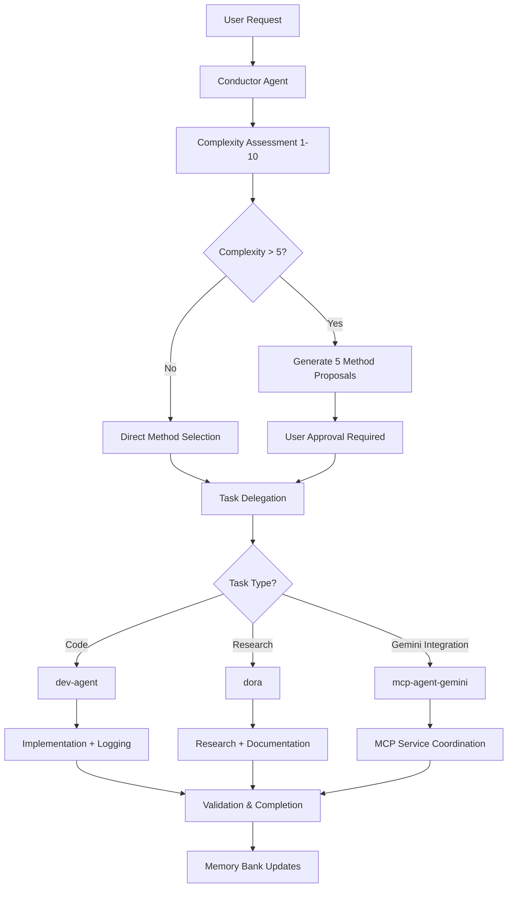

# Agent Governance & Management

## Overview

This document defines the governance framework for the multi-agent system used in the Code Graph RAG MCP project, ensuring systematic coordination, quality control, and architectural integrity across all development activities.

## 🎯 Governance Principles

### GRACE Framework Compliance
All agents operate under the **GRACE Framework** (Graph-RAG Anchored Code Engineering):

1. **Intent-First Architecture**: Machine-readable requirements analysis before implementation
2. **Synthesis from Approved Blueprints**: Deterministic code generation from architectural frameworks
3. **AI-Readable Scaffolding**: Semantic markup with XML-like anchors
4. **Context via Knowledge Graph**: .memory_bank integration for full traceability
5. **Observable AI Belief State**: Transparent decision-making through structured logging
6. **End-to-End Traceability**: Complete linkage from requirements to implementation
7. **Governed Autonomy**: Human oversight with AI freedom within approved frameworks

### Core Governance Rules

#### 1. Mandatory Conductor Usage
**ABSOLUTE REQUIREMENT**: All complex tasks MUST use the Conductor agent.

**Complexity Triggers (Any of the following):**
- Multi-step tasks (>2 steps)
- Cross-file modifications
- Architecture changes
- Performance optimization
- Bug fixes requiring investigation
- Feature integration
- Dependency changes

**Enforcement**: Direct agent access for complex tasks will be rejected.

#### 2. Agent Access Control
| Agent | Access Level | Restrictions |
|-------|-------------|--------------|
| **conductor** | Direct User Access | Orchestration only - NO implementation |
| **dev-agent** | Conductor Only | Cannot accept direct user requests |
| **dora** | Direct + Conductor | Prefers Conductor coordination |
| **mcp-agent-gemini** | Conductor Only | Specialized for Gemini MCP services |

#### 3. Task Validation Requirements
All agent tasks must include:
- ✅ **TASK-XXX Identifier**: Unique tracking number
- ✅ **Chosen Method**: From Conductor's 5 proposals (for implementation tasks)
- ✅ **Memory Bank Context**: Relevant .memory_bank references
- ✅ **ADR Reference**: Architecture Decision Record (if applicable)

## 🔄 Agent Coordination Patterns

### Standard Workflow


### Research Trinity Pattern (Circular Bug Resolution)
**Trigger**: Repeated failures or circular issues detected

1. **Implementation Halt**: Stop all fix attempts immediately
2. **Research Trinity Deployment**:
   - **dora**: Documentation, best practices, historical solutions
   - **mcp-agent-gemini**: Alternative approaches, creative solutions  
   - **Additional agents**: Specialized analysis as needed
3. **Root Cause Investigation**: Focus on underlying causes, not symptoms
4. **Solution Redesign**: Create comprehensive new approach
5. **Validated Implementation**: Execute through dev-agent with safeguards

### Parallel Research Pattern
**Use Case**: Complex research requiring multiple perspectives

1. **Primary Research**: dora leads comprehensive investigation
2. **Parallel Research**: mcp-agent-gemini provides alternative analysis
3. **Synthesis**: Conductor consolidates findings from both agents
4. **Validation**: Cross-reference findings for consistency
5. **Documentation**: Integrated results in Memory Bank

## 📋 Task Management Framework

### TASK-XXX Lifecycle
```
TASK-001: [Created] → [Assigned] → [In Progress] → [Validation] → [Completed] → [Archived]
```

#### Task States
- **TODO**: Identified but not yet started
- **IN_PROGRESS**: Currently being worked on by assigned agent
- **VALIDATION**: Under review and testing
- **DONE**: Completed and validated
- **ARCHIVED**: Moved to historical records

#### Task Tracking Locations
- **Active**: `.memory_bank/current_tasks.md`
- **Historical**: `.memory_bank/tasks_YYMMDD.md` (archived by date)
- **Detailed Logs**: `.memory_bank/logs_llm/TASK-XXX.log`

### Architecture Decision Records (ADR)
**Format**: ADR-XXX linked to TASK-XXX identifiers

#### ADR Triggers
- Architecture changes (complexity >5)
- Technology selection decisions
- Performance optimization strategies
- Integration pattern decisions
- Security implementation choices

#### ADR Template
```markdown
# ADR-XXX: [Decision Title]

**Related**: TASK-XXX
**Status**: [Proposed | Accepted | Superseded | Deprecated]
**Date**: YYYY-MM-DD

## Context
[Background and driving forces]

## Decision
[Chosen solution and reasoning]

## Consequences
[Positive and negative outcomes]

## Implementation
[GRACE compliance markers and semantic scaffolding]
```

## 🛡️ Quality Assurance Framework

### Code Quality Gates
All implementation tasks must pass:

1. **Architectural Compliance**: Follows approved blueprints and ADR decisions
2. **GRACE Standards**: Includes semantic scaffolding and Observable Belief State
3. **Memory Bank Integration**: Updates relevant patterns and documentation
4. **Testing Validation**: Passes all relevant tests
5. **Performance Benchmarks**: Meets established performance targets

### Review Process
1. **Self-Review**: Agent validates against GRACE principles
2. **Automated Validation**: Linting, type checking, and basic tests
3. **Architectural Review**: Conductor validates against approved method
4. **Integration Testing**: End-to-end functionality validation
5. **Documentation Review**: Memory Bank consistency and completeness

### Error Handling & Recovery
- **Failure Detection**: Automated monitoring of task execution
- **Rollback Procedures**: All actions include rollback commands
- **Error Logging**: Comprehensive error documentation in task logs
- **Recovery Protocols**: Systematic approach to failure resolution

## 📊 Monitoring & Metrics

### Agent Performance Metrics
- **Task Completion Rate**: Percentage of successfully completed tasks
- **Quality Score**: Based on review outcomes and rework requirements  
- **Response Time**: Average time from assignment to completion
- **Error Rate**: Frequency of failures and required interventions

### System Health Indicators
- **Coordination Efficiency**: Smooth handoffs between agents
- **Memory Bank Quality**: Documentation completeness and accuracy
- **Architecture Consistency**: Adherence to established patterns
- **User Satisfaction**: Feedback on delivered solutions

### Reporting Framework
- **Daily**: Current task status in `.memory_bank/current_tasks.md`
- **Weekly**: Agent performance summaries
- **Monthly**: Architecture health assessment
- **Quarterly**: Governance framework review and optimization

## 🔧 Agent Configuration Management

### Agent Definitions
Location: `.claude/agents/`
- `conductor.md` - Orchestration agent configuration
- `dev-agent.md` - Implementation agent configuration  
- `dora.md` - Research agent configuration
- `mcp-agent-gemini.md` - Gemini integration agent configuration

### Configuration Standards
Each agent definition includes:
- **Role & Responsibilities**: Clear scope definition
- **Access Controls**: Permitted interactions and restrictions
- **Quality Requirements**: Standards and validation criteria
- **Integration Points**: Memory Bank and other agent interfaces
- **Performance Expectations**: Response time and quality targets

### Version Control
- **Agent Definitions**: Tracked in git with semantic versioning
- **Configuration Changes**: Require ADR documentation
- **Backward Compatibility**: Maintained for existing tasks
- **Migration Procedures**: Systematic updates with validation

## 🚀 Continuous Improvement

### Learning Integration
- **Pattern Recognition**: Identify successful approaches for reuse
- **Failure Analysis**: Systematic review of unsuccessful tasks
- **Best Practice Development**: Codify successful patterns in Memory Bank
- **Agent Evolution**: Regular updates based on performance data

### Feedback Loops
- **User Feedback**: Direct input on solution quality and process efficiency
- **Agent Self-Assessment**: Internal quality metrics and improvement suggestions
- **Cross-Agent Learning**: Share successful patterns between agents
- **System Optimization**: Regular framework updates based on usage patterns

### Innovation Framework
- **Experimental Patterns**: Controlled testing of new approaches
- **Technology Integration**: Systematic evaluation of new tools and methods
- **Process Enhancement**: Regular workflow optimization
- **Capability Expansion**: Strategic addition of new agent capabilities

---

## Quick Reference

### Escalation Paths
1. **Agent Issues**: Report to Conductor for coordination
2. **Quality Problems**: Trigger review process and potential rollback
3. **System Failures**: Activate recovery protocols
4. **Architecture Conflicts**: Create ADR for resolution

### Emergency Procedures
- **Stop All Work**: `HALT` command suspends all active tasks
- **Rollback Changes**: Use logged rollback commands
- **Restore State**: Revert to last known good configuration
- **Incident Documentation**: Create detailed incident reports

### Contact Points
- **Process Questions**: Refer to `.memory_bank/workflows/`
- **Technical Issues**: Check `.memory_bank/troubleshooting/`
- **Architecture Decisions**: Review `.memory_bank/patterns/`
- **Quality Standards**: Consult `CLAUDE.md` and coding standards

---

*This governance framework ensures systematic, high-quality development while maintaining agent autonomy within established boundaries and providing clear escalation paths for issue resolution.*