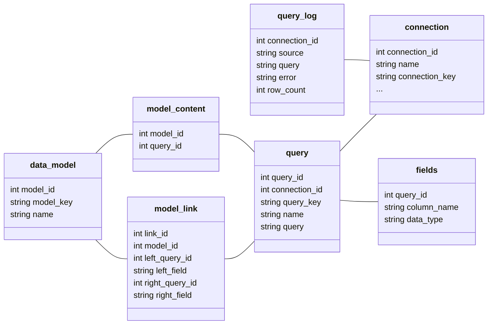

# Database Schema and State Management

This document describes the state database schema and data flow patterns used in xldb_proxy.

## Overview

The xldb_proxy uses DuckDB as an embedded state database to store metadata about connections, queries, data models, and execution history. All state is centralized on the proxy server to ensure consistency across multiple clients.

## State Database Schema

### Entity Relationship Overview



## Core Tables

### connections
Stores database connection configurations with encrypted credentials.

```sql
CREATE TABLE connections (
    connection_id INTEGER PRIMARY KEY AUTOINCREMENT,
    name TEXT NOT NULL,
    connection_key TEXT UNIQUE NOT NULL,
    engine_type TEXT NOT NULL,
    dbms_host TEXT,
    dbms_port INTEGER,
    database_name TEXT,
    user_encrypted TEXT,
    password_encrypted TEXT,
    ssl_config TEXT,
    created_at TIMESTAMP DEFAULT CURRENT_TIMESTAMP,
    updated_at TIMESTAMP DEFAULT CURRENT_TIMESTAMP
);
```

**Key Fields:**
- `connection_id`: Internal identifier (no meaning outside state database)
- `connection_key`: Globally unique key for API calls and import/export
- `name`: User-friendly name (can be different across users)
- `*_encrypted`: Encrypted credential fields

### queries
Stores SQL queries and their metadata.

```sql
CREATE TABLE queries (
    query_id INTEGER PRIMARY KEY AUTOINCREMENT,
    connection_id INTEGER NOT NULL,
    query_key TEXT UNIQUE NOT NULL,
    name TEXT NOT NULL,
    query TEXT NOT NULL,
    description TEXT,
    created_at TIMESTAMP DEFAULT CURRENT_TIMESTAMP,
    last_executed TIMESTAMP,
    execution_count INTEGER DEFAULT 0,
    FOREIGN KEY (connection_id) REFERENCES connections(connection_id)
);
```

**Key Fields:**
- `query_id`: Internal identifier
- `query_key`: UUID-based globally unique identifier
- `name`: Used as table names in heterogeneous queries and MDX pivot tables

### fields
Stores column metadata for query results.

```sql
CREATE TABLE fields (
    field_id INTEGER PRIMARY KEY AUTOINCREMENT,
    query_id INTEGER NOT NULL,
    column_name TEXT NOT NULL,
    data_type TEXT NOT NULL,
    description TEXT,
    is_key BOOLEAN DEFAULT FALSE,
    FOREIGN KEY (query_id) REFERENCES queries(query_id)
);
```

### data_model
Stores data model definitions.

```sql
CREATE TABLE data_model (
    model_id INTEGER PRIMARY KEY AUTOINCREMENT,
    model_key TEXT UNIQUE NOT NULL,
    name TEXT NOT NULL,
    description TEXT,
    created_at TIMESTAMP DEFAULT CURRENT_TIMESTAMP
);
```

### model_content
Links queries to data models.

```sql
CREATE TABLE model_content (
    content_id INTEGER PRIMARY KEY AUTOINCREMENT,
    model_id INTEGER NOT NULL,
    query_id INTEGER NOT NULL,
    FOREIGN KEY (model_id) REFERENCES data_model(model_id),
    FOREIGN KEY (query_id) REFERENCES queries(query_id)
);
```

### model_link
Defines relationships between queries in data models.

```sql
CREATE TABLE model_link (
    link_id INTEGER PRIMARY KEY AUTOINCREMENT,
    model_id INTEGER NOT NULL,
    left_query_id INTEGER NOT NULL,
    left_field TEXT NOT NULL,
    right_query_id INTEGER NOT NULL,
    right_field TEXT NOT NULL,
    relationship_type TEXT DEFAULT 'one_to_many',
    FOREIGN KEY (model_id) REFERENCES data_model(model_id),
    FOREIGN KEY (left_query_id) REFERENCES queries(query_id),
    FOREIGN KEY (right_query_id) REFERENCES queries(query_id)
);
```

### query_log
Stores query execution history and performance metrics.

```sql
CREATE TABLE query_log (
    log_id INTEGER PRIMARY KEY AUTOINCREMENT,
    connection_id INTEGER NOT NULL,
    source TEXT NOT NULL,
    query TEXT NOT NULL,
    execution_time_ms INTEGER,
    row_count INTEGER,
    error TEXT,
    executed_at TIMESTAMP DEFAULT CURRENT_TIMESTAMP,
    FOREIGN KEY (connection_id) REFERENCES connections(connection_id)
);
```

## Key Management Strategy

### Connection Keys
Connection keys are deterministically generated based on essential connection parameters:

```python
def calculate_key(self):
    s = self.params.engine
    s += self.params.sql.dbms_host or ""
    s += str(self.params.sql.dbms_port or "")
    s += self.params.sql.database or ""
    # Exclude user-specific data like names and SSL paths
    return hashlib.sha256(s.encode()).hexdigest()[:16]
```

**Benefits:**
- Same logical connection has same key across different environments
- Enables conflict resolution during import/export
- User-independent keys support multiple names for same connection
- Facilitates data portability between proxy instances

### Query and Model Keys
Queries and models use UUID-based keys for unique identification:

```python
import uuid
query_key = str(uuid.uuid1())  # Time-based UUID
model_key = str(uuid.uuid4())  # Random UUID
```

**Benefits:**
- Guaranteed uniqueness across all environments
- Supports distributed system architecture
- Enables safe concurrent operations

## State Management Patterns

### Stateless Client Architecture

Clients are designed to be stateless, requesting object state from the proxy for each UI interaction:

```python
# Client requests current state
response = requests.get(f"/api/connections/{connection_key}")
connection_state = response.json()

# Display in UI without local caching
render_connection_form(connection_state)
```

**Benefits:**
- Perfect consistency across multiple clients
- Real-time updates visible to all clients
- Simplified client application development
- Server becomes single source of truth

**Trade-offs:**
- Increased network traffic for UI operations
- Higher server load for state queries

### Transaction Management

State database operations use transactions to ensure consistency:

```python
def create_query_with_fields(connection_id: int, query_data: dict, fields: list):
    with state_db.transaction():
        # Create query record
        query_id = state_db.insert("queries", query_data)
        
        # Create field records
        for field in fields:
            field['query_id'] = query_id
            state_db.insert("fields", field)
        
        return query_id
```

### Change Tracking

All significant state changes are logged for audit and debugging:

```python
def log_state_change(table: str, operation: str, record_id: int, changes: dict):
    log_entry = {
        'table_name': table,
        'operation': operation,  # INSERT, UPDATE, DELETE
        'record_id': record_id,
        'changes': json.dumps(changes),
        'timestamp': datetime.now(),
        'user_context': get_current_user_context()
    }
    state_db.insert("change_log", log_entry)
```

## Security Patterns

### Credential Encryption

All sensitive credentials are encrypted before storage:

```python
from tools.crypto import encrypt, decrypt

def encrypt_record(record: dict):
    """Encrypt sensitive fields in connection record"""
    if "password" in record:
        record['password'] = encrypt(record['password'])
    if "user" in record:
        record['user'] = encrypt(record['user'])

def decrypt_record(record: dict):
    """Decrypt sensitive fields when needed"""
    if record.get('password'):
        record['password'] = decrypt(record['password'])
    if record.get('user'):
        record['user'] = decrypt(record['user'])
```

### Key Management

Encryption keys are managed securely:

```python
# Key generation on first run
import secrets
encryption_key = secrets.token_bytes(32)

# Secure storage (platform-specific)
import compat
key_path = compat.get_secure_config_path("encryption.key")
compat.write_secure_file(key_path, encryption_key)
```

## Import/Export Patterns

### Export with Encryption

Data export supports password-based encryption for secure data transfer:

```python
def export_connections(password: str = None) -> dict:
    connections = state_db.select_all("connections")
    
    if password:
        # Re-encrypt with export password
        for conn in connections:
            encrypt_with_password(conn, password)
    
    return {
        'connections': connections,
        'export_timestamp': datetime.now().isoformat(),
        'encryption': 'password' if password else 'none'
    }
```

### Conflict Resolution

Import operations handle conflicts intelligently:

```python
def import_connections(data: dict, conflict_strategy: str = 'prompt') -> dict:
    results = {}
    
    for conn_data in data['connections']:
        connection_key = conn_data['connection_key']
        existing = state_db.get_connection_by_key(connection_key)
        
        if existing:
            if conflict_strategy == 'skip':
                results[connection_key] = 'skipped'
            elif conflict_strategy == 'overwrite':
                state_db.update_connection(existing.id, conn_data)
                results[connection_key] = 'updated'
            else:  # prompt user
                action = prompt_user_for_conflict_resolution(existing, conn_data)
                results[connection_key] = handle_conflict_action(action, existing, conn_data)
        else:
            state_db.insert_connection(conn_data)
            results[connection_key] = 'imported'
    
    return results
```

## Performance Optimization

### Connection Pooling

The state database uses connection pooling for performance:

```python
class StateDatabase:
    def __init__(self, db_path: str, pool_size: int = 10):
        self.db_path = db_path
        self.connection_pool = duckdb.pool(db_path, max_connections=pool_size)
    
    def execute(self, query: str, params: tuple = None):
        with self.connection_pool.connection() as conn:
            return conn.execute(query, params or ())
```

### Query Optimization

State database queries are optimized for common access patterns:

```sql
-- Indexes for common queries
CREATE INDEX idx_connections_key ON connections(connection_key);
CREATE INDEX idx_queries_connection ON queries(connection_id);
CREATE INDEX idx_queries_key ON queries(query_key);
CREATE INDEX idx_fields_query ON fields(query_id);
CREATE INDEX idx_query_log_connection ON query_log(connection_id);
CREATE INDEX idx_query_log_time ON query_log(executed_at);
```

### Caching Strategy

Frequently accessed metadata is cached in memory:

```python
class MetadataCache:
    def __init__(self, ttl: int = 300):  # 5 minutes default TTL
        self.cache = {}
        self.ttl = ttl
    
    def get_connection_metadata(self, connection_key: str):
        cache_key = f"conn_meta_{connection_key}"
        
        if cache_key in self.cache:
            data, timestamp = self.cache[cache_key]
            if time.time() - timestamp < self.ttl:
                return data
        
        # Fetch from database
        data = state_db.get_connection_metadata(connection_key)
        self.cache[cache_key] = (data, time.time())
        return data
```

## Backup and Recovery

### Automated Backups

State database backups are automated:

```python
def create_backup():
    timestamp = datetime.now().strftime("%Y%m%d_%H%M%S")
    backup_path = f"backups/state_db_{timestamp}.db"
    
    # DuckDB supports online backups
    state_db.execute(f"BACKUP DATABASE TO '{backup_path}'")
    
    # Compress backup
    import gzip
    with open(backup_path, 'rb') as f_in:
        with gzip.open(f"{backup_path}.gz", 'wb') as f_out:
            f_out.writelines(f_in)
    
    os.remove(backup_path)  # Remove uncompressed backup
```

### Point-in-Time Recovery

Change logs enable point-in-time recovery:

```python
def restore_to_timestamp(target_timestamp: datetime):
    # Get all changes after target timestamp
    changes = state_db.execute("""
        SELECT * FROM change_log 
        WHERE timestamp > ? 
        ORDER BY timestamp DESC
    """, (target_timestamp,))
    
    # Reverse changes in LIFO order
    for change in changes:
        reverse_change(change)
```

This database schema and state management approach provides a robust foundation for the xldb_proxy system, ensuring data consistency, security, and performance while supporting complex multi-client scenarios.