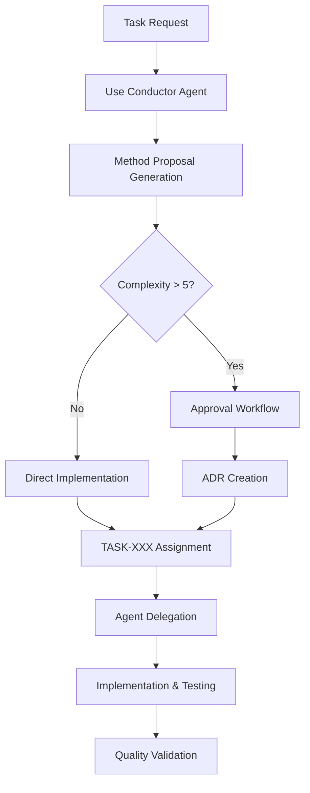

# Development Workflow

## Overview

This document outlines the development workflow for the Code Graph RAG MCP project, emphasizing the mandatory use of the Conductor agent for all complex tasks and systematic approach to development.

## 🚨 Core Principle: Conductor-First Development

**MANDATORY**: All complex development work MUST use the Conductor agent. This is non-negotiable.

### When to Use Conductor Agent

**ALWAYS use Conductor for:**
- 🚨 ANY multi-step task (>2 steps) - NO EXCEPTIONS
- 🚨 ALL codebase analysis and refactoring
- 🚨 ALL architecture changes or performance optimization
- 🚨 ALL bug fixes requiring investigation across multiple files
- 🚨 ALL feature integration or new dependencies
- 🚨 ALL testing and validation of complex changes

### Conductor Usage Pattern

```bash
# STEP 1: ALWAYS start with Conductor
use agent conductor
  [describe the task clearly and completely]

# STEP 2: Let Conductor assess complexity and propose methods
# - Conductor provides 5 method proposals for every task
# - Complexity assessment (1-10 scale)
# - Approval workflow if complexity >5

# STEP 3: Follow Conductor's systematic delegation
# - Proper task breakdown with TASK-XXX identifiers
# - ADR (Architecture Decision Records) creation
# - Specialized agent delegation (dev-agent, Dora, etc.)
```

## 📋 Development Process

### 1. Task Planning



### 2. Method Proposal Process

Every complex task requires 5 method proposals from Conductor:

```typescript
interface MethodProposal {
  id: string;
  title: string;
  description: string;
  complexity: number; // 1-10 scale
  effort: 'low' | 'medium' | 'high';
  risks: string[];
  benefits: string[];
  dependencies: string[];
  timeline: string;
}
```

### 3. Task Tracking System

#### TASK-XXX Identifiers
- **TASK-001 to TASK-024**: Historical tasks (completed)
- **TASK-025+**: Current active development tasks
- Each task gets unique identifier and ADR if complexity >5

#### Current Active Tasks (Example)
- **TASK-025**: Complete memory bank migration and documentation consolidation
- **TASK-026**: Implement enhanced semantic search with vector optimization
- **TASK-027**: Develop comprehensive test suite for all MCP tools
- **TASK-028**: Optimize SQLite-vec integration for better performance

## 🔄 Standard Workflows

### Feature Development Workflow

1. **Task Initiation**
   ```bash
   use agent conductor
     implement new feature: [feature description]
   ```

2. **Method Selection**
   - Conductor provides 5 proposals
   - Review complexity assessment
   - Select optimal approach
   - Get approval if needed

3. **Implementation**
   - ADR creation for significant decisions
   - Specialized agent delegation
   - Incremental development with testing

4. **Validation**
   - Code review and quality checks
   - Performance testing
   - Integration testing

### Bug Fix Workflow

1. **Issue Analysis**
   ```bash
   use agent conductor
     analyze and fix bug: [bug description with context]
   ```

2. **Root Cause Investigation**
   - Systematic investigation across components
   - Impact analysis
   - Solution proposal generation

3. **Fix Implementation**
   - Targeted fix with minimal side effects
   - Comprehensive testing
   - Regression testing

### Refactoring Workflow

1. **Refactoring Planning**
   ```bash
   use agent conductor
     refactor codebase component: [component and goals]
   ```

2. **Impact Assessment**
   - Dependency analysis
   - Risk evaluation
   - Migration strategy

3. **Incremental Refactoring**
   - Step-by-step transformation
   - Continuous testing
   - Performance monitoring

## 🏗️ Architecture Decision Process

### ADR Creation Criteria

ADRs (Architecture Decision Records) are created for:
- Complex tasks with complexity >5/10
- Significant architecture changes
- Technology selection decisions
- Performance optimization strategies
- Integration pattern decisions

### ADR Template

```markdown
# ADR-XXX: [Decision Title]

## Status
[Proposed | Accepted | Superseded | Deprecated]

## Context
[Background and driving forces]

## Decision
[Chosen solution and reasoning]

## Consequences
[Positive and negative outcomes]

## Implementation
[Key implementation details]

## Related Tasks
[TASK-XXX references]
```

## 🤖 Agent Delegation Patterns

### Specialized Agent Usage

#### Dev Agent
- Code implementation and modification
- File system operations
- Build and deployment tasks

#### Dora (Query Agent)
- Database queries and analysis
- Graph traversal operations
- Data extraction and reporting

#### Parser Agent
- Code parsing and AST analysis
- Entity extraction
- Language-specific processing

#### Semantic Agent
- Vector search operations
- Embedding generation
- Similarity analysis

### Delegation Decision Matrix

| Task Type | Primary Agent | Secondary Agents | Conductor Role |
|-----------|---------------|------------------|----------------|
| Code Analysis | Dora | Parser, Semantic | Orchestration |
| Implementation | Dev Agent | Parser | Task breakdown |
| Testing | Dev Agent | All agents | Validation |
| Performance | Semantic | Dev, Dora | Optimization |

## 🔧 Code Quality Standards

### Pre-commit Requirements

1. **Linting and Formatting**
   ```bash
   npx biome check --apply .
   ```

2. **Type Checking**
   ```bash
   npx tsc --noEmit
   ```

3. **Testing**
   ```bash
   npm test
   ```

4. **Build Verification**
   ```bash
   bun run tsup
   ```

### Code Review Checklist

- [ ] Conductor agent used for complex tasks
- [ ] TASK-XXX identifier assigned
- [ ] ADR created if complexity >5
- [ ] All tests passing
- [ ] Performance impact assessed
- [ ] Documentation updated
- [ ] Security implications reviewed

## 📝 Documentation Standards

### Required Documentation

1. **Code Comments**: Minimal, focused on why not what
2. **ADR Records**: For all significant decisions
3. **TASK Tracking**: Progress and outcomes
4. **API Documentation**: For all MCP tools
5. **Architecture Updates**: When structure changes

### Documentation Workflow

1. Document decisions during development
2. Update .memory_bank structure
3. Maintain cross-references
4. Archive completed tasks

## 🚀 Deployment Process

### Build Process

1. **Development Build**
   ```bash
   bun run tsup
   ```

2. **Testing**
   ```bash
   npm test
   ```

3. **Packaging**
   ```bash
   make package
   ```

### Release Workflow

1. **Version Bump**
   ```bash
   npm version [patch|minor|major]
   ```

2. **Build and Test**
   ```bash
   make package && npm test
   ```

3. **Documentation Update**
   - Update CHANGELOG.md
   - Update README.md if needed
   - Archive completed tasks

4. **Git Operations**
   ```bash
   git add .
   git commit -m "Release vX.X.X"
   git tag vX.X.X
   git push --tags
   ```

## 🔍 Quality Assurance

### Testing Strategy

1. **Unit Tests**: Individual component testing
2. **Integration Tests**: MCP tool interaction testing
3. **Performance Tests**: Vector search and parsing benchmarks
4. **End-to-End Tests**: Complete workflow validation

### Performance Monitoring

- Parse throughput: >100 files/second target
- Query response: <100ms for simple queries
- Memory usage: <1GB peak for large repositories
- Vector search: <100ms for 20 results

### Error Handling

- Graceful degradation for parsing errors
- Fallback mechanisms for vector search
- Comprehensive logging and monitoring
- User-friendly error messages

## 📊 Metrics and KPIs

### Development Metrics

- **Task Completion Rate**: TASK-XXX completion velocity
- **ADR Creation Rate**: Architecture decision documentation
- **Code Coverage**: Test coverage percentage
- **Performance Benchmarks**: Speed and memory metrics

### Quality Metrics

- **Bug Rate**: Issues per release
- **Code Review Coverage**: Percentage of code reviewed
- **Documentation Completeness**: Coverage of features
- **User Satisfaction**: Feedback and adoption metrics

## 🔮 Continuous Improvement

### Regular Reviews

1. **Weekly Conductor Reviews**: Assess agent usage patterns
2. **Monthly Architecture Reviews**: Evaluate ADR outcomes
3. **Quarterly Performance Reviews**: Optimize bottlenecks
4. **Semi-annual Process Reviews**: Improve workflows

### Learning and Adaptation

- Analyze Conductor proposal effectiveness
- Refine agent delegation patterns
- Improve task estimation accuracy
- Enhance documentation quality

---

## Related Documentation
- [Agent Delegation Patterns](../patterns/agent_delegation.md)
- [Contributing Guide](../guides/contributing.md)
- [Performance Optimization](../guides/performance_optimization.md)
- [Current Tasks](../current_tasks.md)